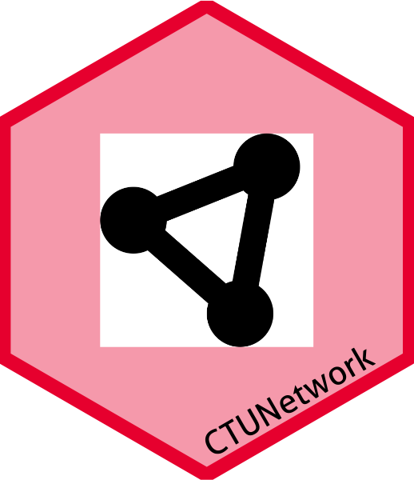

<!-- README.md is generated from README.Rmd. Please edit that file -->

# CTUNetwork 

<!-- badges: start -->

[](https://github.com/CTU-Bern/CTUNetwork)
<!-- [](https://github.com/CTU-Bern/redcaptools/actions) -->

<!-- badges: end -->

`CTUNetwork` contains home-grown functions as well as a Shiny App to
load and interpret [Projectfacts](https://projectfacts.ctu.unibe.ch/)’
CTU Bern internal data.

## Installation

You can install the development version of `CTUNetwork` from github
with:

<!-- install.packages("redcaptools") -->

``` r
remotes::install_github("CTU-Bern/CTUNetwork")
```

<!-- Or from CTU Bern's package universe -->
<!-- ```{r, eval = F} -->
<!-- install.packages("redcaptools", repos = "https://ctu-bern.r-universe.dev") -->
<!-- ```  -->

## Overview

| Function                                   | Purpose                                                                           |
|--------------------------------------------|-----------------------------------------------------------------------------------|
| [`AvgTimeBookings.R`](R/AvgTimeBookings.R) | Cumulative sum of time bookings over package/project levels                       |
| `BuildTable.R`                             | Print a datatable object                                                          |
| `Calculations.R`                           | Computing calculations for HourlyCosts, MoneySpent and TimePercent variables      |
| `convertTime.R`                            | Convert time in minutes as integers to standard HH:MM                             |
| `extractData.R`                            | Extract and format Projectfacts data from the getPFData function                  |
| `filterData.R`                             | Filter ProjectFacts data from the getPFData function                              |
| `FilterNotes.R`                            | Extracting text information encapsulated between html-like tags, e.g. Notes field |
| `ggColorHue.R`                             | Emulate ggplot2 color palette                                                     |
| `NetworkPlot.R`                            | Network plot function - Build the network                                         |
| `shinyApp.R`                               | Run the CTUNetwork app                                                            |
| `StandardDates.R`                          | Standardizing dates to European format, i.e. DD-MM-YYYY                           |
| `themeShiny.R`                             | Customized ggplot2 theme applied to homogenize the plots in Shiny App             |

## Usage

### Shiny App

You can run the shiny app directly with

``` r
CTUNetwork::runCTUNetworkApp()
```

### Isolated functions

First, install Alan’s PF package locally

``` r
remotes::install_local("R:/Projectfacts/ODBC/pf_app/")
```

Then retrieve the data either locally

``` r
All_Tabs <- pf::getPFData()
```

or directly through ODBC (requires DNS to be configured)

``` r
All_Tabs <- pf::getPFData(NULL)
```

Extract and reformat data from the large list of lists (All_Tabs)

``` r
Data <- CTUNetwork::extractData(All_Tabs)
```

Finally, filter and replace Projectfacts key codes by real values

``` r
FiltData <- CTUNetwork::filterData(Data, All_Tabs)
```
